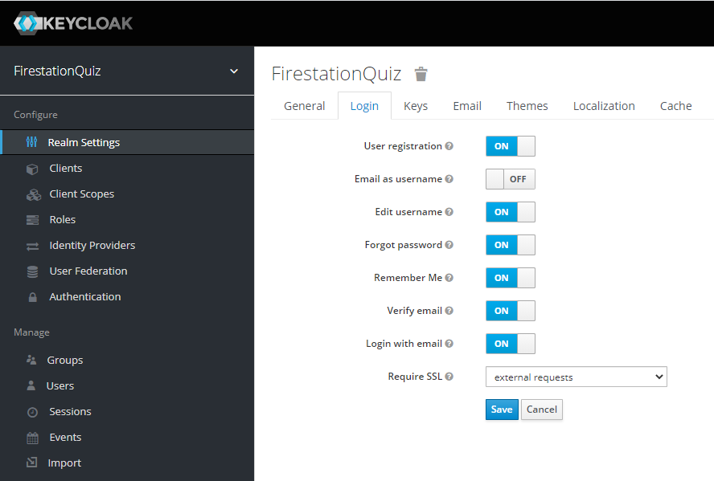

# Authenticatie

## Hoofdvraag

Hoe kan ik een authenticatie systeem op mijn app zetten?

## Reden van het onderzoek

Graag wil ik dat mijn app alleen gebruikt kan worden door specifieke gebruikers.
Daarom wil ik graag mijn app beveiligen, zodat niet iedereen er in kan.
Door dit onderzoek wil ik graag duidelijk gaan krijgen op welke manier ik mijn applicatie kan gaan beveiligen.
Maar ook hoe de beveiliging werkt.

## Hoe ga ik het onderzoek doen

Bij het DOT-Framework zijn er verschillende manieren voor het doen van research.
Je kunt door deze methode goed research doen op verschillende vlakken van je vraag.
Ook kom je hierdoor vaak op een betere oplossing voor je probleem.  
Binnen het DOT-Framework heb je de volgende strategieën:

|                                                     Strategie                                                      | Beschrijving                                                                                                                                                                                    |
| :----------------------------------------------------------------------------------------------------------------: | ----------------------------------------------------------------------------------------------------------------------------------------------------------------------------------------------- |
|   Library<br>    | Onderzoek doen op basis van bestaande bronnen en onderzoeken.                                                                                                                                   |
|       Field<br>        | Onderzoek de meningen van mogelijke gebruikers. Je gaat kijken hoe je je kennis kunt verbreden. Vaak gebruik je in dit onderzoek een enquête om ook de meningen van andere te kunnen gebruiken. |
|           LAB<br>            | Hierbij ga je zaken vergelijken en testen met bijv. unit tests.                                                                                                                                 |
| Showroom<br>  | Hierbij ga je meerdere producten met elkaar vergelijken. Je bekijkt dan welke het beste bij jou applicatie werkt.                                                                               |
| Workshop<br>  | Hierbij maak je een prototype/proof of concept om te kijken hoe het werkt.                                                                                                                      |

Per vraag zal ik gaan kijken welke strategie het beste is.
Er wordt per vraag aangeven welke strategie daar is aangegeven.

### Welke strategieën heb ik gekozen

Over het algemeen zal ik de de library/desk en workshop strategie gebruiken.
Dit houd in dat ik veel bronnen zal gaan lezen er gebruiken, maar ook dat ik een concept ga maken.
De bronnen die ik hoop te gaan gebruiken zijn officiële sites van producten die ik kan gebruiken.  


## Deelvragen

### Wat is authenticatie

#### Betekenis

Authenticatie is het proces waarbij iemand nagaat of een gebruiker, een andere computer of applicatie daadwerkelijk is wie hij beweert te zijn.
Bij de authenticatie wordt gecontroleerd of een opgegeven bewijs van identiteit overeenkomt met echtheidskenmerken, bijvoorbeeld een in het systeem geregistreerd bewijs.
De authenticiteit van het object moet worden nagegaan.
Een computer met daarvoor ontworpen applicaties kan hierbij helpen.

Authenticatie is de tweede stap in het toegangscontroleproces.
De eerste stap in dit proces is identificatie, de derde en laatste stap is autorisatie.  
[Bron: Wikipedia Authenticatie](https://nl.wikipedia.org/wiki/Authenticatie)

#### Mijn interpretatie

Een authenticatie systeem is een beveiliging op je applicatie.
Door middel van dit systeem zorg je dat niet iedereen gebruik kan maken van functionaliteiten van je applicatie.
Het systeem moet controleren of de actor die toegang wil hebben ook echt een actor is die recht heeft op toegang.
Het is vergelijkbaar met een deur met een slot, iemand wil binnen alleen het slot gaat alleen open als iemand de juiste sleutel gebruikt.
In dit geval kun je de authenticatie service dus zien als het slot die de controle uitvoert.
De sleutel is in dit geval dan een token die je van de service terugkrijgt na het invoeren van de juiste login gevevens.
Met deze token kun je dan door naar de verschillende onderdelen van de applicatie.
Wanneer je geen token hebt zal je geen toegang krijgen en terug worden gestuurd naar een andere pagina waar je kunt inloggen of een pagina die publiek is.

#### Gebruikte strategie: Wat is authenticatie

  

- Literature study

### Wat is OAuth


#### Betekenis OAuth

OAuth (Open Authorization) is een open standaard voor autorisatie. Gebruikers kunnen hiermee een programma of website toegang geven tot hun privégegevens, die opgeslagen zijn op een andere website, zonder hun gebruikersnaam en wachtwoord uit handen te geven. OAuth maakt gebruik van tokens, waardoor vertrouwelijke gegevens als een gebruikersnaam of wachtwoord niet afgegeven hoeven te worden. Elk token geeft slechts toegang tot specifieke gegevens van één website voor een bepaalde duur. Zo kan ingesteld worden dat een bepaald programma slechts een jaar toegang heeft tot de gegevens. Hierna kan eventueel opnieuw toegang worden gevraagd.  
[Bron: Wikipedia OAuth](https://nl.wikipedia.org/wiki/OAuth)

#### Mijn definitie van OAuth

Oauth is een veelgebruikte structuur voor het autoriseren van actoren bij een applicatie of website.
Door deze autoresatie is het voor de actoren mogelijk om bij bepaalde gegevens van een andere app te komen.
De basis app geeft de credentials (gebruikersnaam en wachtwoord van de actor) aan de authenticatie service, welke deze vervolgens zal verifiëren.
Indien deze correct zijn krijgt de actor een token die als sleutel dient voor de overige applicaties om zo aan de juiste data te kunnen komen.
Het daadwerkelijk toegang krijgen wordt het autorisatie process genoemd.
Deze token is geldig voor een bepaalde tijd en zal dus ook een keer vervangen moeten worden.
Dit is echter afhankelijk van de applicatie.

#### Gebruikte strategie: Wat is OAuth

  

- Literature study

### Wat is het verschil tussen authenticatie en autorisatie

Authenticatie en autorisatie zijn 2 begrippen die vaak bij elkaar worden gebruikt, maar beide iets anders betekenen.
Er zit zelfs een groot verschil tussen beide.
Bij authenticatie gaat het over het vaststellen of de actor ook echt een gebruiker is die recht heeft op toegang.
Het vaststellen van deze identiteit wordt gedaan door het testen van unieke informatie die alleen bij de gebruiker bekend is.
Dit kan vanalles zijn, van wachtwoorden tot biometrische gegevens.
Bij autorisatie is de indentiteit van de actor al vastgesteld.
In dit process wordt vooral gekeken naar welke gegevens de actor wel of niet te zien krijgt.
Deze 2 begrippen hebben elkaar dus eigenlijk altijd nodig, maar je kunt ze niet verwarren aangezien het totaal verschillende betekenissen zijn.
[Bron: Strephonsays](https://nl.strephonsays.com/authentication-and-vs-authorisation-10227)

#### Gebruikte strategie: Welke bestaande systemen kan ik gebruiken

  

### Wat is keycloak

Keycloak is een open source Identity en Access Management oplossing gericht op moderne applicaties en diensten. Het maakt het eenvoudig om applicaties en services te beveiligen met weinig tot geen code.  
Keycloak is breed inzetbaar door het grote aantal functionaliteiten welke deze bevat.
Hieronder zie je de belangrijkste eigenschappen van Keycloak:

 | Functie                             | Beschrijving                                                                                                                                                                                                                                                                                      |
 | :---------------------------------- | :------------------------------------------------------------------------------------------------------------------------------------------------------------------------------------------------------------------------------------------------------------------------------------------------ |
 | Single-Sign On                      | Doordat gebruikers zich autoriseren met keycloak i.p.v. de applicatie hoeven ze niet steeds overnieuw in te loggen als ze bij een andere app komen. Keycloak regelt dat je door 1 keer in te loggen overal bij kan. (mits de app bij keycloak aangesloten zit)                                    |
 | Identity Brokering and Social Login | Ook is het mogelijk om social login aan te zetten. Dit betekend dat gebruikers geen nieuw account aan hoeven te maken, maar dat ze hun bestaande account van bijv. OpenID, Github, Facebook, Google, enz. kunnen gebruiken. Dit scheelt enorm in het onthouden van de verschillende wachtwoorden. |
 | Admin Console                       | Via de admin console kunnen beheerders alle aspecten van de Keycloak server centraal beheren. Ze kunnen verschillende functies in- en uitschakelen. Ze kunnen identiteitsbemiddeling en gebruikersfederatie configureren.                                                                         |
 | Account Management Console          | Via de accountbeheerconsole kunnen gebruikers hun eigen accounts beheren. Ze kunnen het profiel bijwerken, wachtwoorden wijzigen en tweefactorauthenticatie instellen.                                                                                                                            |
 | Standard Protocols                  | Keycloak is gebaseerd op standaardprotocollen en biedt ondersteuning voor OpenID Connect, OAuth 2.0 en SAML                                                                                                                                                                                       |

Door al deze eigenschappen kan keycloak voor bijna ieder project worden gebruikt om een goede beveiligingsservice op te zetten.  
[Bron: Keycloak About](https://www.keycloak.org/about)

#### Gebruikte strategie: Wat is keycloak


### Hoe gebruik ik Keycloak op mijn applicatie

Om een authenticatie systeem op mijn applicatie te krijgen.
Heb ik gebruik gemaakt van keycloak.

Om te beginnen moeten we zorgen dat we een keycloak server hebben.
Deze kun je downloaden van de [keycloak download pagina](https://www.keycloak.org/downloads)
Voor mijn project heb ik gekozen voor de `Distribution powered by WildFly` versie.
Na het unzippen van de server kunnen we hem starten door het open van de batch file genaamd `standalone.sh`.  
Wanneer deze versie gestart is kunnen we naar het admin pannel gaan welke default gestart wordt op `localhost:8080`.
Bij de eerste keer moet je eerst een admin account aanmaken.  
  
[Bron: Keycloak Getting Started](https://www.keycloak.org/docs/latest/getting_started/index.html)

Uiteindelijk heb je een amdmin account en kun je inloggen.
Na het inloggen kom je in het admin pannel.
Je zit nu op de master waar je de hele keycloak app kan beheren.
Om een losse app te kunnen koppelen gaan we een nieuwe `Realm` aanmaken.
Klik hiervoor op het pijltje achter master en vervolgens op de knop `Add realm`.  

Voer de gegevens in voor een nieuwe app, geef als naam een duidelijke naam zodat je weet tot welk systeem de realm behoort.  
  

Na het maken van de realm gaan we een client voor de realm maken zodat we onze app kunnen gaan connecten.
Hiervoor gaan we in het menu naar `clients`.  
  

Vervolgens selecteren we create en geven we onze nieuwe client een naam en een root URL (dit is de URL waar je app draait.
Bij een default react app <http://localhost:3000/>).
Voor na het inloggen kun je in de verdere configuratie ook een redirect URL instellen.
Een gebruiker wordt na een succesvolle login of logout naar deze pagina gestuurd.

Om te zorgen dat een gebruiker een account kan aanmaken moet je deze instelling aanzetten in de `Realm Settings`.  
  

Nu we alle basis instellingen hebben is het tijd om onze react app te gaan koppelen aan keycloak.
Eerst moeten we de keycloak library installeren op ons react project met de command `npm install keycloak-js`.
Deze library bevat alle info voor de app die we nodig hebben om connectie te kunnen maken met keycloak.
Wanneer deze geïnstalleerd is kunnen we keycloak gaan initialiseren.
Om dit te doen hebben we de basis gegevens van keycloak nodig zodat react weet wat er moet gebeuren.
De configuratie kunnen we vinden onder het `installation` tabblad van de client die we zojuist hebben aangemaakt.
Omdat wij deze als JSON gaan importeren kiezen we de optie `Keycloak OIDC JSON`.  
  

Vervolgens maken we in de `public` map van ons project het bestandje met de naam `keycloak.json`.
Hierin plakken we de code die we bij de vorige stap hebben gekregen.
[In mijn project](https://github.com/Piet2001/FirestationQuiz-View/blob/master/public/keycloak.json) ziet het er als volgt uit.

```JSON
{
    "realm": "FirestationQuiz",
    "auth-server-url": "http://localhost:8080/auth/",
    "ssl-required": "external",
    "resource": "React View",
    "public-client": true,
    "confidential-port": 0
}
```

Nu we echt alle configuratie klaar hebben staan kunnen we onze app beveiligen.
In mijn project heb ik besloten dat echt de complete app beveiligd moet zijn.
Daarom is er voor gekozen om de [index.js](https://github.com/Piet2001/FirestationQuiz-View/blob/master/src/index.js) te beveiligen.

```js
import Keycloak from 'keycloak-js'

let keycloak = Keycloak('./keycloak.json')

keycloak.init({ onLoad: 'login-required' }).success((authenticated) => {
  console.log(keycloak);
  console.log(authenticated);

  if (!authenticated) {
    window.location.reload();
  } else {
    console.info("Authenticated")
  }

  ReactDOM.render(
    <React.StrictMode>
      <App />
    </React.StrictMode>,
    document.getElementById('root')
  );

  sessionStorage.setItem("authentication", keycloak.token);
  sessionStorage.setItem("refreshToken", keycloak.refreshToken);
  sessionStorage.setItem("userName", keycloak.idTokenParsed.preferred_username)

  setTimeout(() => {
    keycloak.updateToken(70).success((refreshed) => {
      if (refreshed) {
        console.debug("Token refreshed" + refreshed)
      } else {
        console.warn("Token not refreshed, valid for "
          + Math.round(keycloak.tokenParsed.exp + keycloak.timeSkew - new Date().getTime() / 1000) + " seconds")
      }
    }).error(() => {
      console.error("Failed to refresh token");
    });

  }, 6000)

}).error(() => {
  console.error("Authenticated Failed")
})
```

Zoals hierboven te zien importeren we keycloak van de library.
Vervolgens connecten we deze met het configuratie bestand wat we in de public map hebben gemaakt.
Met deze info kunnen we keycloak initialiseren.
Hierbij geven we aan dat het benodigd is om ingelogt te zijn om de pagina te laden.
Vervolgens controleren we of de gebruiker echt is ingelogd.
Zo niet, dan herladen we de pagina zodat het proces overnieuw wordt uitgevoed.
Wanneer dit wel het geval was zal de app ingeladen worden.
De gebruiker krijgt de app dan te zien.
Op de achtergrond worden een aantal gegevens opgeslagen zodat we die makkelijk kunnen blijven gebruiken in de app.
Denk hierbij aan de toegangstoken, refresh token en de gebruikersnaam.
De refresh token is nodig om wanneer de normale token te oud is een nieuwe te kunnen krijgen.
Het systeem zal om de x tijd (welke ingesteld is binnen de app) de token vernieuwen.
Door het doorlopen van dit systeem krijgen we een inlog pagina op onze app.  
[Bron: Medium, Secure react with Keycloak](https://walkingtreetech.medium.com/a-detailed-guide-to-securing-react-applications-with-keycloak-9434a95b4f4f)

Het project waar de deze codes in zitten is volledig te vinden in [deze repo.](https://github.com/Piet2001/FirestationQuiz-View)

### Gebruikte strategie: Hoe gebruik ik Keycloak op mijn applicatie


- Prototyping

## Bronnen

- [Wikipedia Authenticatie](https://nl.wikipedia.org/wiki/Authenticatie)
- [Wikipedia OAuth](https://nl.wikipedia.org/wiki/OAuth)
- [Strephonsays](https://nl.strephonsays.com/authentication-and-vs-authorisation-10227)
- [Keycloak About](https://www.keycloak.org/about)
- [Keycloak Getting Started](https://www.keycloak.org/docs/latest/getting_started/index.html)
- [Medium, Secure react with Keycloak](https://walkingtreetech.medium.com/a-detailed-guide-to-securing-react-applications-with-keycloak-9434a95b4f4f)
