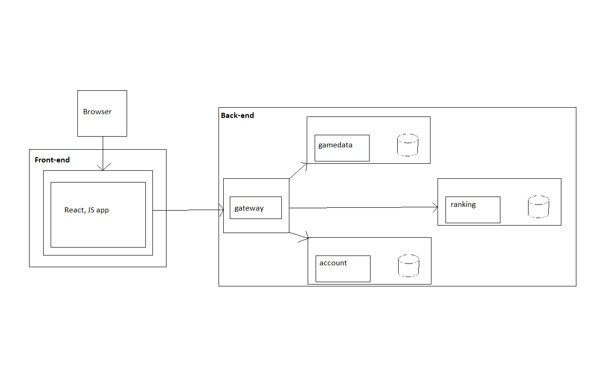

# Professional

## Wat houd de leeruitkomst professional in

Voor het leerdoel professional was het belangrijk om goed te communiceren met de stakeholders en duidelijk je voortgang vast te leggen.
Dit portfolio is dus een belangrijk element voor het aantonen van deze leeruitkomst

## Mijn ontwikkeling

Voor het maken van het project ben ik begonnen met het bedenken van een app die ik wilde gaan maken.
Ik wilde graag een soort game gaan maken die makkelijk te begrijpen was.
Al snel kwam ik op een oude bekende quiz uit.
Ook wilde graag een persoonlijk element in mijn app stoppen, hierdoor werd ook het onderwerp van de quiz bepaald.
Ook kwam de inspiratie hiervoor uit een discord server voor mensen met interesse hulpdiensten, hier delen we namelijk ook geregeld foto's van kazernes en dan kan de rest raden.
Toen het algemene idee er was ben ik een schets gaan maken van de microservices die ik nodig zou gaan hebben.  
  
Met deze schets ben ik gaan overleggen met Leon, vanuit waar de belangrijkste zaken werden opgesteld en ik kon gaan beginnen met mijn project.

In het begin heb ik veel onderzoek gedaan naar verschillende dingen die ik mogelijk nodig zou gaan hebben.
Vervolgens ben ik begonnen en heb ik proef projecten gemaakt en eigen projecten opgezet.
Uiteindelijk heb ik deze ook allemaal met Leon besproken.
Alle feedback die ik heb gehad, heb ik verwerkt in feedpulse en vervolgens ook zoveel mogelijk in mijn project.

Ook heb onderzoeken gemaakt die staan gedocumenteerd in de documentatie map van deze repo.
