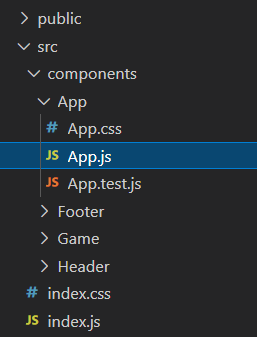

# Software Quality

## Wat is software Quality

Om de kwaliteit van software te bepalen ben je afhankelijk van meerdere factoren.
Is een app goed te gebruiken en is de structuur van de code duidelijk zodat meerdere mensen er makkelijk aan kunnen werken.
Omdat de techniek steeds blijft verbeteren is het belangrijk dat je app makkelijk valt te updaten naar de nieuwere technieken.
Ook moet je zorgen dat andere mensen altijd verbeteringen kunnen aanbrengen in de code zonder veel moeite te moeten doen om de code te begrijpen.
Gelukkig zijn er algemene structuren waar je op kan werken die vele mensen zullen begrijpen.
Op die manier kun je er voor zorgen dat je app lang zal kunnen worden bijgewerkt.
Natuurlijk is de kwaliteit van de app zelf ook belangrijk.
Kun je er mee doen wat je er mee zou moeten doen, is deze makkelijk in gebruik, enz.
Ook bij mijn project heb ik hier op gelet.
Natuurlijk is het ook belangrijk dat alle code goed getest wordt, zodat je zeker weet dat het doet wat het moet doen.
Wanneer je dit combineert met de CI van je CI/CD dan worden alle testen automatisch uitgevoerd.
Door alles goed in te stellen kun je zorgen dat je op je productie minder to geen stukken code krijgt die niet werken.
Het goed testen van alles is dus belangrijk. Ook wanneer je met meerdere mensen aan een project werkt.
Je kunt de testen dan uitvoeren voor een merge zodat je kans op problemen kleiner is.

## Mijn ontwikkeling

Voor de kwaliteit ben ik begonnen naar het bekijken van verschillende opensource projecten.
Hiervanuit heb ik kunnen zien wat een veelgebruikte manier is van het maken van de apps.
Ook van de tutorials heb ik veel opgestoken qua structuur die vaak gebruikt word.

Voor mijn react ben ik begonnen met eerst alle bestanden in de meest gebruikte structuur te zetten (componenten map).  
  

In de frond-end zit momenteel nog niet veel functionaliteit die getest kan worden, daarom is er nu alleen een test die kijkt of de app laad zonder problemen.
Op deze manier weten we vooraf al of er problemen gaan zijn voor het opstarten.

```js
it('renders without crashing', () => {
  const div = document.createElement('div');
  ReactDOM.render(<App />, div);
  ReactDOM.unmountComponentAtNode(div);
});
```

Maar niet alleen bij de frond-end is de kwaliteit belangrijk, maar ook bij de backend.
Daarom heb ik ook hier op de mappen structuur gelet, zodat dit voor vele duidelijk is.  
  
Misschien is het bij de backend zelf belangrijker aangezien daar de meeste logica van je app zit.
Daarom heb ik ook bij de backend testen gemaakt.
Aangezien deze meer logica heeft zijn hier ook meer testen.
Ik ben begonnen met aan aantal unit tests om te controleren of de constructors goed werken.

```java
@Test
void NameEqualsNameFromConstructor() {
    Station station = new Station(1,"Helmond","https://media.discordapp.net/attachments/534476070192414730/824276101953880074/Brandweer_Helmond2.jpg");
    assertThat(station.getName()).isEqualTo("Helmond");
    assertThat(station.getImageUrl()).isEqualTo("https://media.discordapp.net/attachments/534476070192414730/824276101953880074/Brandweer_Helmond2.jpg");
}

@Test
void NameNotEqualToOldAfterSet() {
    Station station = new Station(1, "Test Station", "This is a link ;)");
    station.setName("Another Name");
    assertThat(station.getName()).isNotEqualTo("Test Station");
    assertThat(station.getImageUrl()).isEqualTo("This is a link ;)");
    assertThat(station.getName()).isEqualTo("Another Name");
}
```

Natuurlijk is alleen het testen van een constructor en get/set niet genoeg.
Omdat het systeem moet communiceren met andere systemen is het belangrijk om te weten dat je communicatie gaat werken.
En dan vooral dat de output die je systeem geeft ook aansluit op wat je in het andere systeem verwacht.
Hiervoor gebruik ik integratie tests.
Om zeker te zijn dat de tests niet afhankelijk zijn van vele factoren of foute data van de developer is er gekozen voor een test database.
Voor deze test database was wel een extra configuratie bestand nodig.

```java
spring.datasource.url=jdbc:h2:mem:db;DB_CLOSE_DELAY=-1;MODE=MySQL
spring.datasource.driverClassName=org.h2.Driver
spring.datasource.username=sa
spring.datasource.password=sa
spring.jpa.database-platform=org.hibernate.dialect.H2Dialect
spring.jpa.hibernate.ddl-auto=create-drop
spring.datasource.initialization-mode=always
```

Omdat het in een memorydatabase betreft kan het niet heel veel kwaad dat het wachtwoord al plain text staat, maar voor de productie database is het verstandig om de database credentials niet te vermeldingen. Hiervoor kun je systeem variable gebruiken.
Hier een voorbeeld van hoe het er uit ziet in de productie configuratie.

```java
#spring.application.name=game-data-service
server.port=8084
spring.jpa.hibernate.ddl-auto=update
spring.jpa.generate-ddl=true
spring.datasource.platform=org.hibernate.dialect.MySQL5InnoDBDialect
spring.jpa.properties.hibernate.dialect=org.hibernate.dialect.MySQL57Dialect
spring.datasource.driverClassName=com.mysql.cj.jdbc.Driver
spring.datasource.url=jdbc:mysql://${DATABASE_HOST}/${DATABASE_NAME}?allowPublicKeyRetrieval=true&useSSL=false
spring.datasource.username=${DATABASE_USERNAME}
spring.datasource.password=${DATABASE_PASSWORD}
```

Maar alleen het aanmaken van de configuratie is niet voldoende om alles te kunnen testen.
Het is ook belangrijk dat je data hebt in je database voor de test.
Het fijnste is dat je weet wat er staat zodat je goed kunt controleren of alles overeen komt met wat je wil.
Het data in de databse toevoegen kun je in spring makkelijk laten doen door een `data.sql` bestand aan te maken.

```sql
INSERT INTO STATION (ID, NAME, IMAGE_URL) VALUES
(1, 'Helmond', 'https://media.discordapp.net/attachments/534476070192414730/824276101953880074/Brandweer_Helmond2.jpg'),
(2, 'Deurne', 'https://cdn.discordapp.com/attachments/832601082500612137/832601422176583710/Post_Deurne_5-7-20192.jpg'),
(3, 'Asten', 'https://cdn.discordapp.com/attachments/832601082500612137/834368841915957258/Post_Asten_12-4-191.jpg');
```

bij het opstarten zal spring door de `spring.datasource.initialization-mode=always` weten dat dit bestand moet worden uitgevoerd.
Daarna kun je testen of je echt de 3 kazernes krijg die je verwacht wanneer je ze allemaal opvraagt.

```java
@Test
void GetAllStations() throws Exception {
    mvc.perform(get("/gamedata/all")
            .contentType(MediaType.APPLICATION_JSON)
            .accept(MediaType.APPLICATION_JSON))
            .andExpect(status().isOk())
            .andExpect(jsonPath("$.[0].id").value(1))
            .andExpect(jsonPath("$.[0].name").value("Helmond"))
            .andExpect(jsonPath("$.[0].imageUrl").value("https://media.discordapp.net/attachments/534476070192414730/824276101953880074/Brandweer_Helmond2.jpg"))
            .andExpect(jsonPath("$.[1].id").value(2))
            .andExpect(jsonPath("$.[1].name").value("Deurne"))
            .andExpect(jsonPath("$.[1].imageUrl").value("https://cdn.discordapp.com/attachments/832601082500612137/832601422176583710/Post_Deurne_5-7-20192.jpg"))
            .andExpect(jsonPath("$.[2].id").value(3))
            .andExpect(jsonPath("$.[2].name").value("Asten"))
            .andExpect(jsonPath("$.[2].imageUrl").value("https://cdn.discordapp.com/attachments/832601082500612137/834368841915957258/Post_Asten_12-4-191.jpg"));
}
```

In mijn applicatie is het alleen een "probleem" dat de output random is.
Hierdoor kun je vooraf niet weten welke output je gaat krijgen.
Om toch te weten dat hij de output geeft die ik wil hebben voor mijn frond-end controleer ik of de json alle paths bevat die ik wil hebben.

```java
@Test
void GetNewQuestion() throws Exception {
    mvc.perform(get("/gamedata/new")
            .contentType(MediaType.APPLICATION_JSON)
            .accept(MediaType.APPLICATION_JSON))
            .andExpect(status().isOk())
            .andExpect(jsonPath("$.option1").hasJsonPath())
            .andExpect(jsonPath("$.option2").hasJsonPath())
            .andExpect(jsonPath("$.option3").hasJsonPath())
            .andExpect(jsonPath("$.option4").hasJsonPath())
            .andExpect(jsonPath("$.answer").hasJsonPath())
            .andExpect(jsonPath("$.imageUrl").hasJsonPath());
}
```

Natuurlijk is het testen van de code belangrijk maar ook structuur en mogelijke lekken dichten is belangrijk.
Om mijn code extra te controleren voor dit soort fouten gebruik ik SonarQube.
Hiermee worden door de CI extra tests uitgevoerd die de code controleren op bugs.
Deze testen runnen op de PullRequests en dev en master branches.
Door deze analyses kan ik de kwaliteit van de code steeds blijven verbeteren en controleren.

In een PR krijg je namelijk een bericht over de resultaten.  
  

Ook is er een algemene overview voor de master branch.
  

## Bronnen

- [SonarQube](https://www.sonarqube.org/)
- [SonarCloud](https://sonarcloud.io/)
